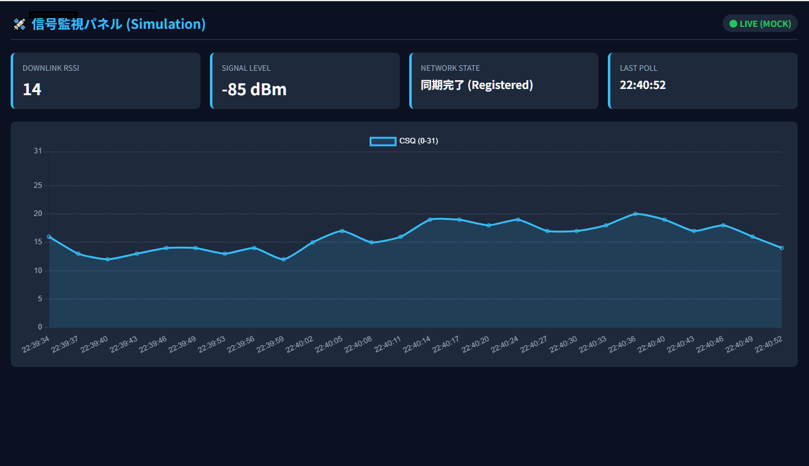
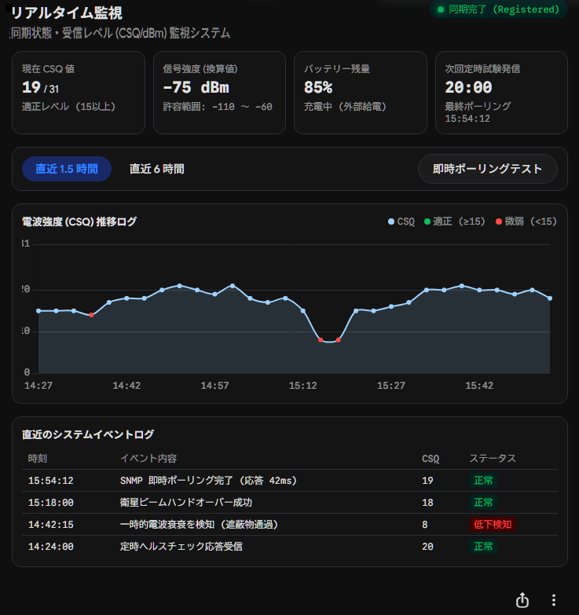

# **IsatMon** 

## `ATコマンド電話`で受信状態を監視する小さなツールです。
Windows 11 に最初から入っているものだけで動き、インターネットにつながらない環境で使います。

C# で書いているのは「AT コマンドを 1 つ送って応答を返す」`IsatIo.exe` だけです。
どのコマンドを送り、結果をどう解釈し、どう表示するかは、PowerShell・設定ファイル・HTML 側にあります。
C# を書ける人がいなくても保守できる構成です。

## 評価版のイメージ

* まずは基本動作を確認するための最小機能を目指す。



## 将来の構想

* 最小動作ができた時点で本格的な表示に作り直す。



## 特長

- **Web サーバ不要** ? `index.html` をダブルクリックで開くだけ。収集側が `data.js` を書き出し、画面がそれを読みます
- **AT コマンドは外出し** ? 追加したい項目は設定ファイルに 1 行足すだけ
- **実機なしで試せる** ? 疑似データの `-Mock` モード
- **対応コマンドの調査ツール** ? `Probe.bat` が機器の対応状況を一覧にします
- **止まったことに気づける** ? 更新が止まると、画面右上が **STALE**(赤)になります
- **完全オフライン** ? Chart.js を同梱しています

## 仕組み

```
[IsatPhone 2] ──COM── IsatIo.exe ?── Monitor.ps1 ──┬─? data.js        ?── index.html (ブラウザ)
                      (I/O だけ)     (収集ループ)    └─? logs/isat_YYYYMM.csv
```

設計の詳細は [docs/architecture.md](docs/architecture.md)、AT コマンドの対応範囲と調べ方は [docs/at-commands.md](docs/at-commands.md) を参照してください。

## 動作環境

Windows 11(Windows PowerShell 5.1 と .NET Framework 4.x が標準で入っています)。追加のインストールは不要です。

## クイックスタート

`app/` フォルダの中で作業します。

1. **`build.bat`** ? `IsatIo.exe` を作ります(Windows 標準の `csc.exe` を使用)
   - できたら `IsatIo.exe -HELP` を実行すると、使い方と引数の説明が表示されます
2. **`MonitorMock.bat`** ? 疑似データでダッシュボードが動くことを確認します
3. 実機につなぐ
   1. `Monitor.bat` を一度起動すると、`Config.ps1` が自動で作られます。止めて、`$Port` を実際の COM 番号に直します
   2. **`Probe.bat`** ? 機器が対応している AT コマンドを調べます
   3. **`Monitor.bat`** ? 実機の値で動きます

社内ネットワークなど外部につながらない PC へは、`app/` フォルダごとコピーすれば動きます。
USB メモリを使えない場合は、Git(または GitHub の ZIP)経由で導入します。手順は [docs/deploy-via-git.md](docs/deploy-via-git.md) を参照してください。

## バッチファイルの使い方

`app/` フォルダの 4 つの `.bat` は、どれもダブルクリックで動きます。コマンドプロンプトから実行してもかまいません(どこから実行しても、自分のフォルダに移動してから動きます)。
実行が終わると `pause` で止まり、「続行するには何かキーを押してください」と出るので、結果を読んでから閉じられます。

| バッチ | 役割 | 引数 | できるもの |
|---|---|---|---|
| `build.bat` | `IsatIo.cs` から `IsatIo.exe` を作る | なし | `IsatIo.exe` |
| `MonitorMock.bat` | 疑似データで画面を確認する(実機不要) | なし | ブラウザが開き、グラフが動く |
| `Monitor.bat` | 実機を監視する | `-Mock`、`-IntervalSec <秒>` | `logs\isat_YYYYMM.csv` と `data.js` |
| `Probe.bat` | 機器が対応している AT コマンドを調べる | `-Mock`、`-ListFile <ファイル名>` | `probe_日時.txt` |

### `build.bat`

- Windows に入っている `csc.exe`(.NET Framework 4.x)で `IsatIo.exe` を作ります。64bit 版が見つからなければ 32bit 版を使います。
- 成功すると `BUILD OK: IsatIo.exe`、失敗すると `BUILD FAILED` と表示され、その上にコンパイラのエラーが出ます。
- `IsatIo.cs` を直したときも、これを実行し直します。

### `MonitorMock.bat`

- 疑似データを 3 秒ごとに作り、ブラウザで `index.html` を開きます。画面右上は `LIVE (MOCK)` になります。
- COM ポートには触りません。最初の動作確認や、画面(`index.html`)をいじるときに使います。

### `Monitor.bat`

- 実機の値を、`Config.ps1` の周期(既定 180 秒)で取得します。ブラウザで `index.html` も自動で開きます。
- 初回は `Config.ps1` が自動で作られます。`$Port` を実際の COM 番号に直してから使ってください。
- 引数は、コマンドプロンプトから付けて実行します(ダブルクリックでは渡せません)。

  ```
  Monitor.bat                      実機を監視 (周期は Config.ps1 の $PollSec)
  Monitor.bat -Mock                疑似データ
  Monitor.bat -IntervalSec 10      周期を 10 秒にする (動作確認用)
  ```

  ダブルクリックで引数付きにしたいときは、`Monitor.bat` のショートカットを作り、「リンク先」の末尾に ` -IntervalSec 10` のように足します。

### `Probe.bat`

- `probe_commands.txt` のコマンドを順に送り、結果を `probe_日時.txt` に保存します。`Monitor.bat` は先に止めておきます。
- `Probe.bat -ListFile 別のファイル.txt` で、別のコマンド一覧を使えます。`Probe.bat -Mock` は、実機なしの試し実行です。

### 止めかた

- `Monitor.bat` と `MonitorMock.bat` は止めるまで動き続けます。**Ctrl+C** を押すか、ウィンドウを閉じます。「バッチ ジョブを終了しますか」と聞かれたら `Y` を入力します。
- 止めたあとも、ブラウザの画面は開いたままです。更新が止まると、右上が **STALE**(赤)になります。
- 次に起動すると、同じ月の CSV から直近のグラフを復元して再開します。

### 共通の動き

- 中では `powershell.exe -NoProfile -ExecutionPolicy Bypass -File ...` を呼んでいます。ポリシーの設定を書き換えず、この起動だけ実行を許可します。組織のポリシーで禁止されている場合は、管理者に相談してください。
- `.bat` は日本語を含まない(ASCII のみ)ようにしてあります。cmd が cp932 を使うため、日本語を入れると文字化けします。

## ファイル構成

```
app/
├─ IsatIo.cs            COM ポート I/O 専用。AT コマンドは引数で受け取る (触らない)
├─ build.bat            IsatIo.cs → IsatIo.exe
├─ Config.sample.ps1    設定のひな形。初回に Config.ps1 へ自動コピーされる
├─ Monitor.ps1          収集ループ。CSV 保存と data.js 出力
├─ Common.ps1           IsatIo.exe の呼び出しと -Mock の疑似応答
├─ Probe.ps1            対応 AT コマンドの調査
├─ probe_commands.txt   Probe が送るコマンド一覧 (1 行 1 コマンド)
├─ index.html           画面
├─ chart.umd.min.js     Chart.js 4.5.1 (同梱)
└─ *.bat                ダブルクリック用ランチャ
docs/                   設計メモ、AT コマンド表(at-command-table.md)、導入手順(deploy-via-git.md)
THIRD_PARTY_LICENSES/   同梱ライブラリのライセンス
```

## よく触る場所

| やりたいこと | 場所 |
|---|---|
| COM 番号・取得周期・定時試験発信の時刻 | `Config.ps1` |
| 画面に項目(カード)を足す | `Config.ps1` の `$Extras` |
| 登録状態の表示名を変える | `Config.ps1` の `$RegText` |
| 調べたい AT コマンドを足す | `probe_commands.txt` |
| 画面の見た目 | `index.html` |

## 注意

- COM ポートは 1 本につき 1 プログラムだけです。`Monitor.bat` と `Probe.bat` は同時に動かさないでください。
- `logs\isat_YYYYMM.csv` を Excel で開いたままにすると、その間は追記できず警告が出ます。コピーしてから開いてください。
- `.bat` は `-ExecutionPolicy Bypass` で起動します。組織のポリシーで PowerShell の実行が禁止されている場合は、管理者に相談してください。
- `.ps1` `.cs` `probe_commands.txt` は **UTF-8(BOM 付き)** で保存してください。BOM がないと、日本語環境の PowerShell 5.1 や `csc.exe` が ANSI(cp932)と誤読して文字化けします。
- 定時試験発信(`$CallTimes`)は既定で無効です。衛星電話の発信は通話料がかかります。

## 検証状況

- PowerShell 7.4 + Mono 上のモック、および代役の `IsatIo.exe` を使った実機経路(引数の受け渡し・COM エラーからの復帰・定時発信)で動作を確認しています。
- **実機のシリアル通信と Windows PowerShell 5.1 での動作は未確認です。** 初回は `MonitorMock.bat` で確かめてから実機に進んでください。

## ライセンス

[MIT License](LICENSE) ? Copyright (c) 2026 Yuichi Matsui (JH0VEQ)

## サードパーティ

- [Chart.js](https://www.chartjs.org/) 4.5.1 (MIT)  ライセンスは [THIRD_PARTY_LICENSES](THIRD_PARTY_LICENSES/Chart.js-LICENSE.md)
